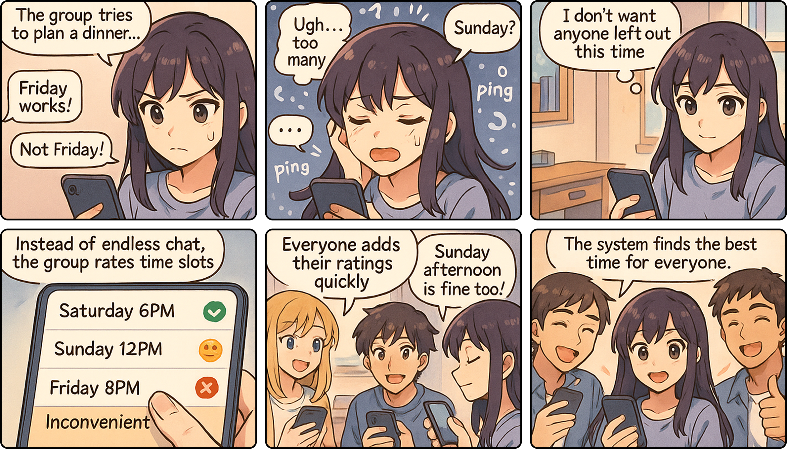
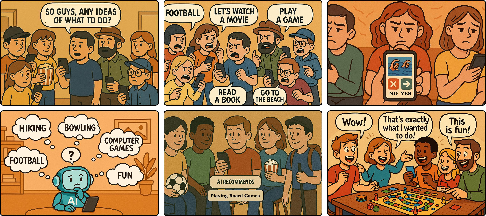
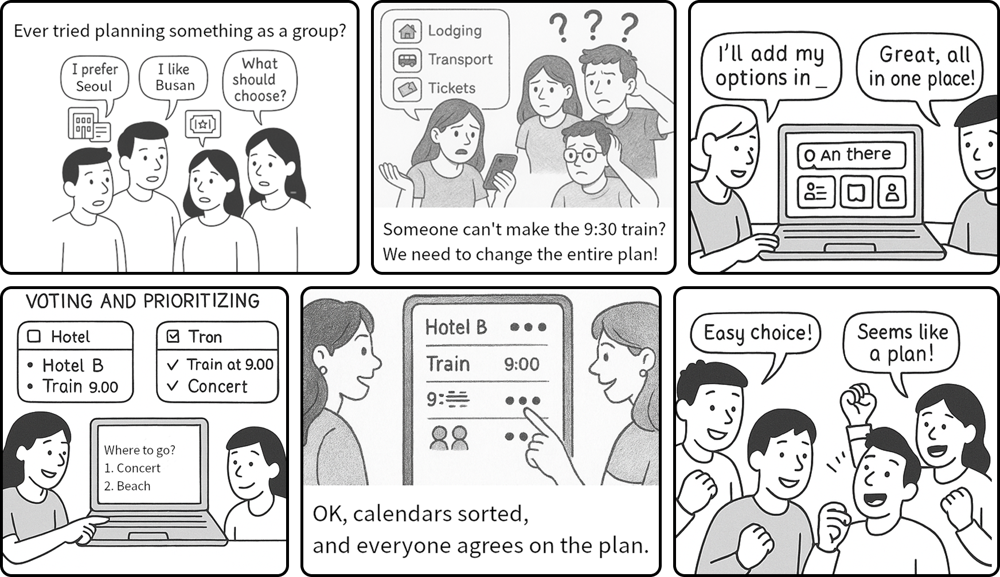

# Ideation

## Final Team Name

Meet2Go

## Problem Statement

Groups often fail to find common availability efficiently, leading to frustration and missed opportunities for shared activities.

> **Note:** The initial problem statement was broader
> *“Many people struggle to coordinate common availabilities for activities (trips, activities, restaurants…).”*  
> Based on studio feedback, it was refined to a narrower scope. Consequently, some HMW questions and solution ideas still reflect the initial, broader framing.

## Problem Background

Coordinating common availabilities for social activities remains a frequent and frustrating challenge. Personal experience highlights this: planning a holiday with friends fell apart due to schedule conflicts that only surfaced late in the process, and a trip to Busan as exchange students became fragmented, with participants traveling on different dates due to scattered discussions in separate group chats. These examples reflect broader issues identified in research: coordinating group plans typically requires multiple rounds of communication, and even then, conflicts often persist. A survey by Doodle found that scheduling a single group event can take over 30 minutes and five interactions [1]. While mainstream calendars already include conflict detection (e.g., Microsoft Outlook’s scheduling assistant), they rarely represent uncertainty or provide adaptive suggestions, limiting their usefulness for real-world social planning [2]. This problem matters because frictions in arranging shared activities erode social connection — a strong determinant of health and well-being [3].

## Motivation

Coordinating group activities is fundamentally a social process: it depends on individual preferences, mutual trust, and collective negotiation. Pure automation cannot capture the nuances of personal constraints or the dynamics of group decision-making, and relying on a single organizer does not scale as groups grow larger. Social computing offers a way to harness distributed input from many participants while reducing the overhead of endless discussions and miscommunication. In this sense, the challenge is best understood as a social computing problem, where technology structures and supports human collaboration rather than replacing it.

## HMW Questions

- HMW **leverage** the initial loneliness of newcomers to **engage** in group activities?
- HMW **reduce** the friction of **organizing** events in a new environment?
- HMW **lower** the **social barrier** for shy or introverted users to join group activities?
- HMW make last-minute or **spontaneous** meetups easy to organize and join?
- HMW make it easier for **large groups** to find times that work for everyone without **frustration**?
- HMW prevent **miscommunication** and **fragmented** discussions in group planning?
- HMW ensure everyone can **enjoy** a shared experience without getting **lost** in logistics?
- HMW reduce the **stress** and overwhelm that comes with **coordinating** many participants?
- HMW help groups discover **shared** interests or **priorities** that make planning easier?
- HMW help people **remember** and **track** group commitments effortlessly?
- HMW **encourage** people to participate even if they’re usually hesitant or busy?
- HMW turn **fragmented** discussions into a clear, **unified** plan everyone can follow?

### Top 3 HMW Questions

1. HMW reduce the friction of organizing events in a new environment?
2. HMW make it easier for large groups to find times that work for everyone without frustration?
3. HMW help groups discover shared interests or priorities that make planning easier?

### Selection Process

After writing down the HMW questions, we reviewed them to ensure that they were neither too broad nor too narrow, and that we had the same interpretation of each one. After that, each group member voted for their top three or four HMW questions, and we kept the ones with the most votes.

## Solution Ideas

**For “HMW reduce the friction of organizing events in a new environment?”**

- A suggestion board where members share event ideas and others vote, making collective interests visible.
- A central hub where the group pools options (lodging, transport, tickets) and decides together by voting.
- A trust system where participants rate organizers, and badges signal reliability to the community.
- A progress tracker where all members see pending tasks, with shared checklists that anyone can update.
- An AI tool that clusters members by availability and helps form smaller sub-groups when full alignment fails.

**For “HMW make it easier for large groups to find times that work for everyone without frustration?”**

- A calendar sync where participants reveal only availability windows, protecting privacy while enabling group coordination.
- A conflict flag that shows the group who is excluded and suggests small shifts everyone can agree on.
- A voting tool where each member rates time slots, and the system aggregates input for a fair group choice.
- A rotating model where scheduling preference shifts between members, balancing fairness over multiple events.
- A priority-based scheduler where members mark must-attend activities, and the system ensures the group aligns around them.

**For “HMW help groups discover shared interests or priorities that make planning easier?**

- An interest heatmap that visualizes shared hobbies, making overlaps across the group immediately visible.
- A tag system where members label their interests, and the group receives activity suggestions based on overlaps.
- A swipe survey where each member votes on activity ideas, and group feedback is aggregated into AI recommendations.
- A group profile that reflects the collective identity (e.g., “70% foodies”), visible to all and updated as members contribute.
- A trend feed where groups see what other similar communities are doing, inspiring shared priorities.
- A goal tool where members share personal goals (e.g., relax, network), and activities are suggested to meet overlapping aims.

## Top 3 Solution Ideas

1. A voting tool where each member rates time slots, and the system aggregates input for a fair group choice.
    - Goes beyond tools like When2Meet by using weighted preferences (ideal/acceptable/inconvenient) rather than binary availability.
    - Includes adaptive suggestions when no perfect overlap exists, such as proposing small shifts or subgroup formation.
    - Adds a social dimension: visualizing who might be excluded to encourage fairer compromises.
2. A swipe survey where each member votes on activity ideas, and group feedback is aggregated into AI recommendations.
    - Provides a lightweight, playful interaction (swiping instead of typing or filling forms).
    - Aggregates votes into AI-generated group suggestions, surfacing overlapping interests (e.g., “Board games + dinner fits 80%”).
    - Helps shape a group identity by showing trends (e.g., “most members prefer social activities”), making decision-making more engaging.
3. A central hub where the group pools options (lodging, transport, tickets) and decides together by voting.
    - Unlike a static Google Doc or Notion board, the hub is purpose-built for real-time group activities planning.
    - Organizes inputs into clear categories (lodging, transport, activities) with structured voting and progress tracking.
    - Highlights both consensus and minority needs, reducing invisible organizer labor and ensuring everyone feels heard.

## Storyboards (3)

### A voting tool where each member rates time slots, and the system aggregates input for a fair group choice



### A swipe survey where each member votes on activity ideas, and group feedback is aggregated into AI recommendations



### A central hub where the group pools options (lodging, transport, tickets) and decides together by voting.



### Process of using AI

The process of generating the storyboards involved iterative planning and refinement. First, for the dinner scheduling storyboard, we drafted the overall narrative and identified six panels covering the main stages: problem, frustration, idea, tool interface, group participation, and resolution. To improve precision, we reformulated the descriptions into a structured JSON format with captions and dialogue, which guided the AI more effectively. This enhanced clarity but still produced outputs that sometimes misaligned with our intent, particularly in text readability and scene interpretation. To address this, we switched to a more advanced image generation model and refined the prompts, which yielded more coherent results. Second, for the activity selection storyboard, we used six sequential narrative prompts (prompt1–prompt6) in a descriptive comic style rather than JSON. This approach allowed greater flexibility but required additional iterations to ensure consistent emotions and group dynamics. Finally, in both cases, the complete workflow – for each storyboard – took about three hours: 30–45 minutes of brainstorming, 15 minutes of JSON or prompt structuring, and roughly two hours of iteration, followed by layout and textual adjustments in Figma. The third one followed a more traditional workflow, where each slide was generated sequentially, and text have been edited later to meet the narrative. While this does allow for shorter workflow since the iteration process took much less, it meant the cohesion between panels was suboptimal due to the disconnected nature of generation.

Generative AI presented both advantages and drawbacks. First, its main benefit was aesthetics: the AI produced polished and visually appealing storyboards that conveyed frustration, relief, and joy more effectively than simple sketches. This made the outputs particularly valuable for pitches or presentations, especially given our limited drawing skills. Second, the main limitation was efficiency, since refining prompts, correcting misinterpretations, and iterating on outputs often took longer than creating rough drafts by hand. Overall, both methods – structured JSON for precision and descriptive prompts for flexibility – enabled the production of coherent, high-quality storyboards, but this quality came at the cost of increased time and effort in prompt engineering and iteration.

**Prompts Used**

A voting tool where each member rates time slots, and the system aggregates input for a fair group choice

```
Generate a 6-panel storyboard in anime style. The story shows a group of university students trying to plan a dinner, facing conflicting chat messages. Eventually, they use a voting tool where each member rates their availability, and the system suggests the best time. Use warm lighting and clear facial expressions to show frustration, thinking, relief, and joy. Captions are part of the panels, and speech/thought bubbles appear when necessary.

{
  "style": "anime",
  "panels": [
    {
      "description": "A girl (Mina) looks at her phone, surprised and slightly stressed. The screen shows chaotic group chat messages: 'Not Friday', 'Sunday', etc. Caption on top: 'The group tries to plan a dinner but their chat has conflicting messages.'",
      "speech_bubbles": [],
      "caption": "The group tries to plan a dinner but their chat has conflicting messages"
    },
    {
      "description": "Mina holds her head in frustration. She looks overwhelmed by too many messages. Chat bubbles float around her head with 'What about' and '?'. Caption on top: 'Too many messages, no clear answer.'",
      "speech_bubbles": [],
      "caption": "Too many messages, no clear answer"
    },
    {
      "description": "Mina sits at her desk, thoughtful, hand on cheek. A light bulb icon appears as she has an idea. Thought bubble: 'What if everyone could rate the times, and we’ll pick what works for all.'",
      "speech_bubbles": [
        {
          "type": "thought",
          "text": "What if everyone could rate the times, and we’ll pick what works for all"
        }
      ],
      "caption": null
    },
    {
      "description": "Close-up of Mina’s phone showing three time slots with colored labels: 'Saturday 6PM - Ideal', 'Sunday 12PM - Acceptable', 'Friday 8PM - Inconvenient'. Each has a colored icon (green, yellow, red).",
      "speech_bubbles": [],
      "caption": null
    },
    {
      "description": "Several friends (3-5 students) are smiling and rating times on their phones. Mina is in the center. Caption at bottom: 'Everyone rates the times following their availabilities.'",
      "speech_bubbles": [],
      "caption": "Everyone rates the times following their availabilities"
    },
    {
      "description": "Everyone is gathered in a group, smiling and happy. No phones. Mina, cheerful, says: 'I’m glad everyone is here.'",
      "speech_bubbles": [
        {
          "type": "speech",
          "character": "Mina",
          "text": "I’m glad everyone is here"
        }
      ],
      "caption": null
    }
  ]
}
```

A swipe survey where each member votes on activity ideas, and group feedback is aggregated into AI recommendations

```
{
"prompt1": """I need a frame, where a large group of people meets and they have 
been wondering what do, some one should say, so guys, any ideas of what to do? 
It should be a diverse group of people, where everyone holds a phone""",

"prompt2": """Next frame (same cartoon style): more and more people appear, each proposing their own idea. 
They’re all holding phones, arguing over what to choose, with frustration and negative emotions clearly 
shown on their faces.""",

"prompt3": """Next frame (same style): a person is holding a phone, 
filling out a questionnaire about their interests.""",

"prompt4": """Next frame (same style): AI sitting in the middle of the room. 
The AI is analyzing the users’ interests — ‘hiking,’ ‘bowling,’ ‘computer games,’
 and ‘football’ — and is thoughtfully considering which activity to choose.""",

"prompt5": """Next frame (same style, horizontal): AI recommends doing board games.
 All participants are gathered, attentively listening to the AI’s recommendation.""",
  
"prompt6": """Final frame: everyone is enjoying board game night together. They smile, laugh, and exclaim things like 
 “Wow, this is exactly what I wanted!” and “This is so much fun!”"""
}
```

A central hub where the group pools options (lodging, transport, tickets) and decides together by voting

```markdown
Generate a storyboard with each frame showing the following images:

1. The Problem
A group of friends is planning a weekend trip. Their group chat is messy:
One person shares three different hotels.
Another suggests two train times.
Someone else finds tickets for a concert.
Messages get lost, people feel unheard, and decision-making drags on.

2. The Central Hub
They switch to the central hub platform.
Each member adds their options (lodging, transport, tickets) into the hub.
Everything is now in one place, clearly laid out.

3. Exploring Together
The hub displays options in organized categories:
Hotels in one list with prices, locations, and pictures.
Train times in another.
Activities and tickets in a third.
This gives everyone a shared “menu” to browse, instead of scattered messages.

4. Voting and Prioritizing
Each person votes on their preferred options.
The system shows tallies and highlights where the group overlaps.
Example: Everyone prefers Hotel B (closer to city center), most want the early train, and the concert is a unanimous yes.

5. Reaching Consensus
Instead of debates, the group quickly sees the majority choice.
Minority voices still show up (e.g., two people need vegetarian meals → noted for planning).
Decisions feel democratic and fair because everyone had input.

6. Resolution
Within an hour, the group has:
Booked Hotel B.
Bought concert tickets.
Reserved seats on the early train.
The planning process shifts from frustrating coordination to efficient collaboration. Everyone feels heard, and the group is excited for the trip.
```

## References

[1] Doodle Content Team, “The comprehensive guide to scheduling technology platforms,” *Doodle*, Mar. 24, 2025. [Online]. Available: [https://doodle.com/en/resources/best-practices/guide-to-scheduling-technology-platforms/](https://doodle.com/en/resources/best-practices/guide-to-scheduling-technology-platforms/?utm_source=chatgpt.com)

[2] R. D. Bowler, B. Bach, and L. Pschetz, “Exploring uncertainty in digital scheduling, and the wider implications of unrepresented temporalities in HCI,” in *Proc. CHI ’22*, New Orleans, LA, USA, Apr. 30–May 6, 2022. ACM. Available: https://vishub.net/papers/Bowler2022uncertainty.pdf

[3] J. Holt-Lunstad, T. B. Smith, and J. B. Layton, “Social relationships and mortality risk: A meta-analytic review,” *PLoS Medicine*, vol. 7, no. 7, e1000316, 2010. Available: https://journals.plos.org/plosmedicine/article?id=10.1371%2Fjournal.pmed.1000316