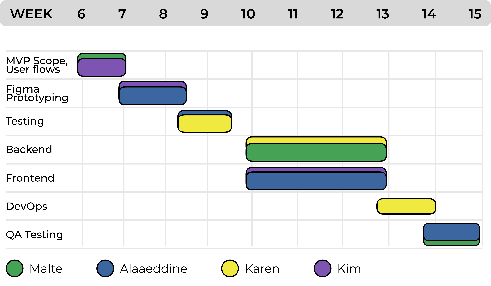

# Pitch

## Problem Statment

Friend groups often struggle to make collective decisions — whether it’s *when to meet, what to eat, or what activity to do together*. These discussions typically happen in group chats, which quickly become chaotic, repetitive, and inconclusive. Existing tools, like polls in messaging apps or scheduling platforms, oversimplify opinions into binary yes/no answers, failing to capture preference strength or create a sense of fairness.

As a result, groups face delays, confusion, and unsatisfying outcomes, with many people feeling unheard. This not only wastes time but also reduces opportunities to share meaningful experiences together.

## Solution

Our solution is Meet2Go, a weighted voting platform that makes group decision-making both efficient and enjoyable. Instead of endless back-and-forth, members swipe through proposed options to express their level of preference:

- Left → Doesn’t work for me
- Right → Works for me
- Up → Works perfectly (Amazing!)

This swipe-based input captures both acceptance and intensity of preference, transforming decision-making into a fast, visual, and engaging activity. Unlike static checklists, it avoids survey fatigue and encourages full participation.

The app then aggregates these weighted inputs into a ranked consensus list, highlighting the options that maximize group satisfaction. This allows friends to quickly identify where common ground lies and make decisions that feel fair and transparent.

Beyond just scheduling, Meet2Go can be applied to a variety of group contexts – from planning trips, to picking restaurants, to choosing activities. By combining simplicity, social engagement, and fairness, the platform creates a unified hub for collective decisions, ensuring groups spend less time debating and more time enjoying experiences together.

Finally, Meet2Go promotes stronger social bonds and inclusivity by giving every member an equal voice in the decision process. By making group choices transparent and fair, it reduces frustration, strengthens trust, and transforms coordination into a shared, positive experience.

## Core Tasks

- **Create a group (“Quest”)**
    
    Users create a dedicated group space (e.g., *“Trip to Busan”*, *“Night Out”*) and invite friends. This task is core because it establishes a centralized hub for collaboration, preventing fragmented chats across multiple apps. The app enables this through an easy group creation flow where users can name the “Quest”, and share an invite link with their friends.
    
- **Start a poll**
    
    Users launch a poll to decide on a specific question, such as *“Where should we eat?”* or *“Which day works?”*. This focuses the group on one decision at a time, reducing confusion. The app supports this by providing a simple interface where the poll creator specifies the topic, adds initial options and opens it for votes and contributions.
    
- **Propose options**
    
    Users contribute their own ideas (e.g., a restaurant, an activity, or a time slot) to an open poll. This ensures that decision-making is inclusive, not just led by one organizer. The platform automatically enriches suggestions with images and marks the contributor’s vote as “Amazing!” automatically to streamline participation.
    
- **Swipe to vote**
    
    Users swipe left, right, or up to show how strongly they feel about each option. This captures both acceptance and preference strength, making the process engaging, inclusive and efficient. It also transforms tedious voting into an engaging, low-friction activity that encourages more participation. The app provides a swipe-based interface that encourages quick, playful input from everyone.
    
- **View results together**
    
    Users see a ranked list of the group’s preferences once voting is complete. This highlights where consensus is strongest and helps everyone agree quickly. The app tallies weighted votes automatically and displays results in a clear, visual summary, therefore allowing the group to quickly move forward.
    

## **Competitive Analysis**

Groups today rely on three main types of tools for collective decision-making. Each works well in certain contexts but fails to provide a complete, engaging, and fair solution.

- **Specialized Voting Platforms (PollUnit, Doodle, Loomio, Slido, Eatwith, Wanderlog)**
    
    These platforms are feature-rich and effective in their specific domains, such as classroom voting, event planning, or travel coordination. However, they are often scattered across multiple apps, requiring constant switching. They are also heavy for casual use and, importantly, none supports flexible voting for places or activities.
    
- **Scheduling Tools (When2Meet, Timeful, Doodle in time-use cases)**
    
    These tools excel at one thing: finding overlapping availabilities. Their simple UI and quick setup (no logins required in the case of When2Meet) make them easy to use, and they visualize time overlaps effectively. But they are narrowly focused on scheduling and cannot extend to decisions about restaurants, activities, or locations. Larger groups also make them difficult to manage.
    
- **Messenger Polls (KakaoTalk, WhatsApp, Telegram, Messenger)**
    
    Polls built into chat apps are lightweight and frictionless, requiring zero onboarding since users are already in the conversation. They are quick and convenient for casual “where/when” questions. However, they are text-only, quickly unreadable when options grow, and easily buried in message history. They are also fragmented across platforms and often restrict participation to the poll creator, limiting collaboration.
    

### Why Meet2Go?

While existing tools technically support decision-making, they rely on repeated questionnaires and static polls. Every decision has to be turned into another vote, which quickly causes survey fatigue. This discourages participation, slows down the process, and often leaves many voices unheard.

Meet2Go replaces surveys with quick, playful swipes, lowering the barrier to input and keeping engagement high. By combining weighted preferences, engaging swiping, and unified decision-making (time, place, activity), Meet2Go ensures that groups reach decisions that are faster, fairer, and more satisfying – all within a single platform.

## **Timeline and Responsibilities**

**MVP Scope & User Flows (Week 6–7):** Define the features of the minimum viable product (MVP) and Create detailed user flows to map how users will navigate the app (from registration to scheduling events).

**Figma Prototyping (Week 7–9):** Develop a high-fidelity Figma prototypes following the principles of HCI.

**Initial Testing (Week 9–10):** Conduct usability tests of the Figma prototype and identify confusing navigation points.

**Backend Development (Week 10–13):** Set up database schema and implement core backend logic, ensuring APIs are well-documented and ready for frontend integration.

**Frontend Development (Week 10–13):** Develop the React-based user interface, connecting it to backend APIs.

**DevOps Setup & Continuous Integration (Week 12–14):** Prepare deployment environment, configure automated builds, testing pipelines, and deployment scripts.

**Final QA Testing & Bug Fixes (Week 13–15):** Conduct a full testing cycle, Log and fix bugs, polish UI/UX, and validate pipeline stability.