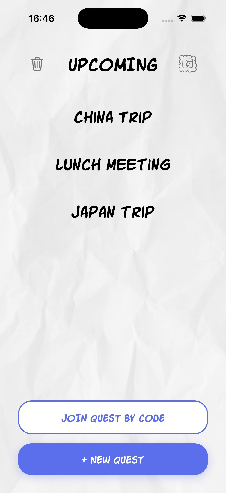
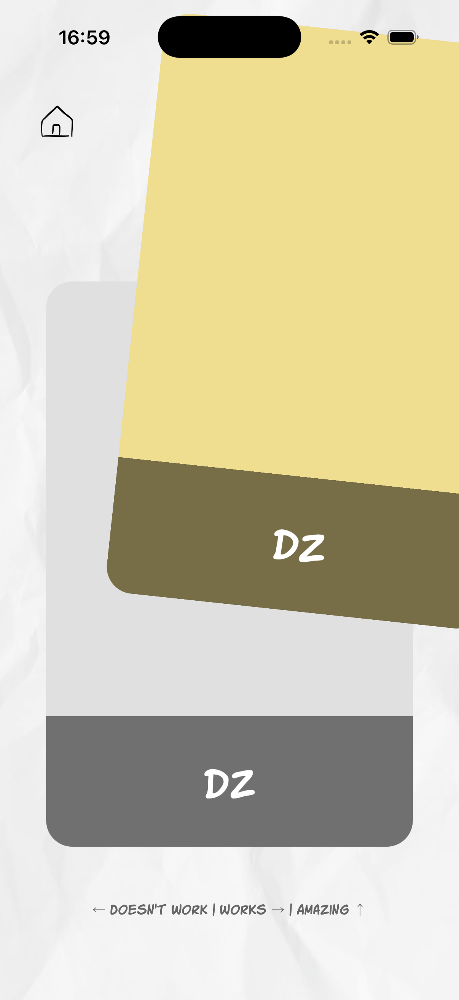
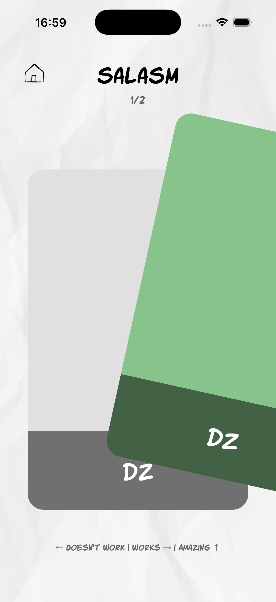
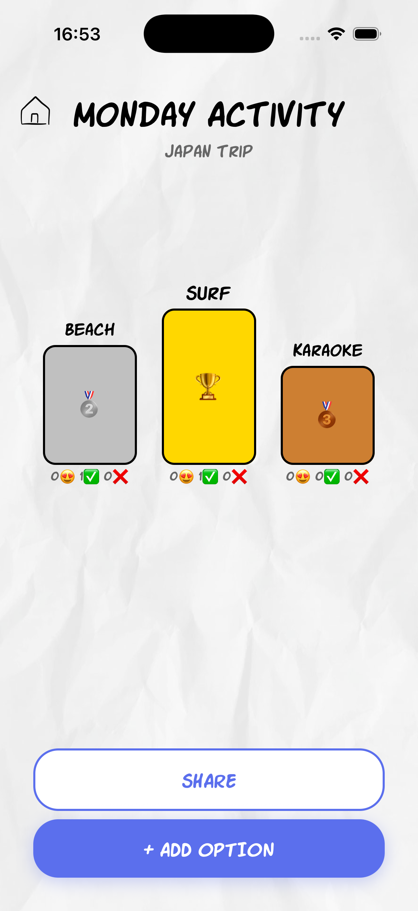
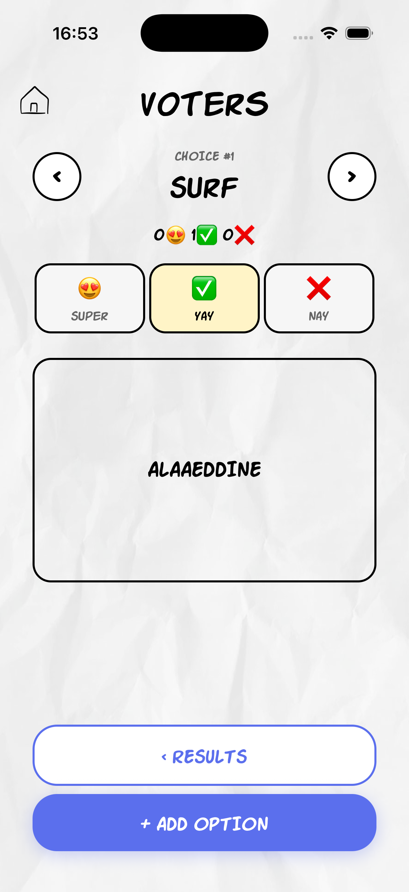

# DP#4 – Hi-Fi Prototype

**Team:** Meet2Go

## Project Summary

**Problem:** Friend groups often fail to make collective decisions efficiently because group chat discussions are chaotic, fragmented, and fail to capture the nuance of individual preferences (e.g., "I'm okay with this" vs. "I love this").

**Solution:** Meet2Go is a mobile-first decision-making app that transforms tedious planning into a fun, swipe-based game where users express preference strength on options to reach a fair consensus.

**Unique Approach:** Unlike traditional polls that offer binary yes/no choices or complex scheduling tools that feel like work, Meet2Go uses a Tinder-style swipe interface to capture weighted preferences ("Doesn't Work", "Works", "Amazing"), making the process engaging while ensuring the final decision truly reflects the group's collective happiness.

**Three Core Tasks:**
1.  **Create a Quest & Start a Poll:** Establishing a dedicated space for the trip or event and launching specific decision topics.
2.  **Swipe to Vote:** Using intuitive gestures to express preference strength on options.
3.  **View Results:** Reviewing the ranked consensus to make a final group decision.

## Instruction

Here is a quick tour of the Meet2Go interface, highlighting the core workflow from creating a trip to making a decision.

### 1. Create a Quest & Start a Poll
The journey begins by creating a "Quest" — a dedicated home for all decisions related to a trip or event.

*   **Step 1:** Tap the **"+ New Quest"** button on the home screen.
*   **Step 2:** Enter a name for your trip (e.g., "Japan Trip") and set an end date.
*   **Step 3:** Once inside the quest, tap **"+ New Poll"** to ask a specific question (e.g., "Where to eat?").
*   **Step 4:** Add options for your friends to vote on. AI generated images are automatically added to each option.

*Figure 1: The Home Screen showing active quests and the button to start a new one.*

*Figure 2: Creating a new poll and adding options.*

### 2. Swipe to Vote
This is the heart of Meet2Go. Instead of boring checkboxes, users swipe through cards to vote.

*   **Step 1:** Tap on an active poll.
*   **Step 2:** You will see options presented as full-screen cards.
*   **Step 3:** **Swipe Left** for "Doesn't Work" (❌), **Swipe Right** for "Works" (✅), or **Swipe Up** for "Amazing" (😍).
*   **Highlight:** As you drag the card, the screen changes color (Red, Green, Gold) to give you immediate visual feedback before you release.

*Figure 3: Swiping Up to vote "Amazing" on an option.*

*Figure 4: Swiping Right to vote "Works".*

### 3. View Results
Once voting is done, the group needs to see the winner.

*   **Step 1:** After finishing your votes, tap **"See Results"**.
*   **Step 2:** View the ranked list of options. The winner is highlighted with a trophy 🏆.
*   **Step 3:** Tap on any option to see a detailed breakdown of who voted what. This helps ensure everyone is happy with the final choice.

*Figure 5: The ranked results screen showing the winning option.*

*Figure 6: Detailed view showing exactly who voted "Amazing", "Works", or "Doesn't Work".*

## Prototype URL

**Live Prototype:** https://meet2go.vercel.app/

## Git Repository

**Repository:** https://github.com/alaaeddineahriz/meet2go

*(See README.md in the repository for setup and running instructions.)*

## Libraries and Frameworks

We utilized the following technologies to build our high-fidelity prototype:

**Core Frameworks:**
*   **React Native (via Expo):** For building a cross-platform mobile application.
*   **Expo Router:** For file-based navigation and deep linking.
*   **TypeScript:** For type safety and robust code.

**UI & Interactions:**
*   **React Native Reanimated:** For smooth, 60fps animations (essential for the swipe cards).
*   **React Native Gesture Handler:** For handling complex touch interactions and swipes.
*   **React Rough Notation:** For hand-drawn style highlights.

**State & Data Management:**
*   **Zustand:** For lightweight global state management.
*   **React Query (@tanstack/react-query):** For managing server state, caching, and synchronization.
*   **Supabase Client:** For connecting to our backend services.

**Backend Services:**
*   **Supabase Auth:** For user authentication.
*   **Supabase Database (PostgreSQL):** For storing quests, polls, and votes.
*   **Supabase Realtime:** For live updates when friends vote.
*   **Supabase Storage:** For hosting option images.

## Individual Reflections

### Alaaeddine AHRIZ
*   **Contribution:** Initiated the project and led the design and development of the high-fidelity prototype. Worked on the core features of the app, including the swipe-based voting system, real-time results display, authentication, and PWA support. Implemented UI improvements, icons, and responsive design fixes for web and mobile PWA.
*   **Difficulties:** Handling cross-platform compatibility (Web vs. Native), specifically with PWA viewport issues and Safari zoom behavior. Ensuring smooth swipe animations and card positioning.
*   **Useful Skill:** Advanced React Native styling, PWA configuration with Expo, and implementing Google Authentication in a mobile/web hybrid app.

### Malte KINDERMANN
*   **Contribution:** Focused on platform unification (Web vs. Native), ensuring consistent navigation controls (home/back buttons) across devices. Fixed UI bugs like overflowing borders and implemented logic for expiry dates.
*   **Difficulties:** Debugging platform-specific UI inconsistencies and ensuring the navigation flow felt natural on both web and mobile.
*   **Useful Skill:** Cross-platform debugging and UI standardization in React Native.

### Kim SEUNGJAE
*   **Contribution:** Implemented key features like the "Who Voted Which" screen, share button functionality (showing actual hosted URL), and the option to remove quests. Fixed critical bugs related to joining via link/code and improved voter statistics clarity.
*   **Difficulties:** Handling complex data relationships for the "Who Voted Which" screen and ensuring deep linking worked correctly for joining quests.
*   **Useful Skill:** Deep linking implementation and complex state management for detailed user statistics.

### Kim DOLMAGAMBETOV
*   **Contribution:** [No specific commits found in git history. Please add contribution manually.]
*   **Difficulties:** 
*   **Useful Skill:**
