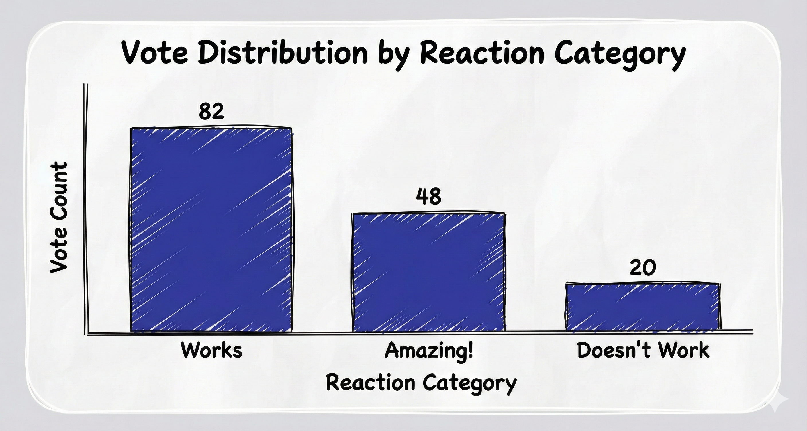
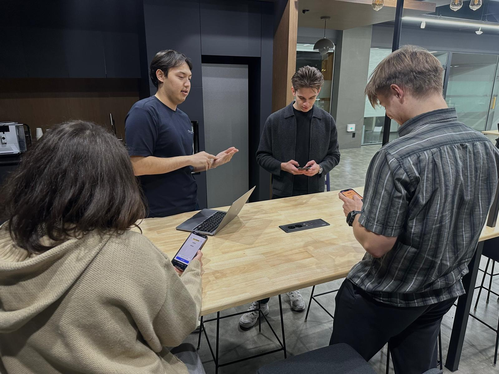
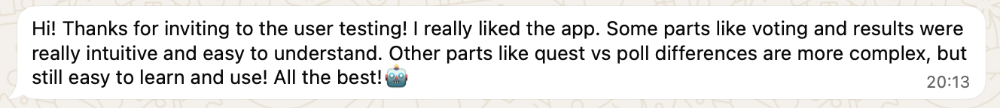

# DP#5 – Final Report

**Team:** Meet2Go

## Project Summary

**Problem:** Friend groups often fail to make collective decisions efficiently because group chat discussions are chaotic, fragmented, and fail to capture the nuance of individual preferences.

**Solution:** Meet2Go is a mobile-first decision-making app that transforms tedious planning into a fun, swipe-based game where users express preference strength on options to reach a fair consensus.

**Unique Approach:** Using a Tinder-style swipe interface to capture weighted preferences ("Doesn't Work", "Works", "Amazing"), making the process engaging while ensuring the final decision truly reflects the group's collective happiness.

## Representative Screenshots

*Figure 1: **The Swipe Voting Interface** — Users vote on options using intuitive gestures: swipe **left** for "Doesn't Work" (red), **right** for "Works" (green), or **up** for "Amazing!" (gold). Each card displays an AI-generated image and the option title. This Tinder-inspired UX makes voting feel like a game rather than a chore.*

*Figure 2: **The Consensus Results View** — After all members vote, the winning option is displayed with a recap of the weighted preferences. Users can see who voted and how, ensuring transparency. The algorithm on the backend removes social friction by letting the algorithm decide rather than individuals advocating for their preference.*

*Figure 3: **Quest Creation Flow** — Users create a "Quest" (decision) and add options. Each option automatically generates an AI image (using DALL-E) ensuring all suggestions have equal visual appeal regardless of text description quality or image choice. This levels the playing field and makes even simple text options feel engaging and "real."*

## Quality Arguments

Meet2Go delivers a "great" user interface by fundamentally redesigning the social chore of group coordination into a playful, engaging interaction.

**1. Transforming "Work" into "Play" (Incentives):**
Traditional scheduling tools feel administrative. Meet2Go’s swipe-based interactions (inspired by social apps) leverage familiar, low-friction gestures to lower the barrier to participation. The immediate visual feedback (card color changes) satisfy the user’s need for responsiveness, making the act of voting feel like a game rather than a survey.

> “Voting felt very familiar, just like Tinder. Once I read the hint, I quickly learned a new intercation of 'Amazing!' reaction.”  
> — *User 5, 16 y.o., school student*

**2. Capturing Nuance via Simple UI:**
A key quality of the interface is its ability to capture complex social data—preference intensity—without complex controls. The decision to use a 3-way swipe (Left/Right/Up) is a novel UI component that maps intuitively to human feelings ("Doesn't Work", "Works", "Amazing!"). This supports the expected social interaction by preventing the "lukewarm consensus" problem where groups settle for the option everyone "tolerates" but nobody "likes."

> “Results are very clear and nicely working — it’s obvious what people actually liked.”
> — *User 1, 25 y.o., CS student*

**3. Visual Polish and Responsiveness:**
The application uses React Native Reanimated to ensure smooth animations, which is critical for the tactile feel of the cards. The use of AI-generated images for every option ensures that even a text-based suggestion feels visual and engaging, enhancing the "window shopping" experience of picking a restaurant or activity.

> “The automatic picture generation is amazing!”
> — *User 2, 25 y.o., office worker*

## Deployment Summary

We deployed Meet2Go on Vercel and conducted a stress test with **30** external participants. During the study, users created **15** unique quests and cast over **150** votes. The system performed reliably, handling real-time updates and concurrent voting sessions without interruptions.

*Figure 6: Vote distribution from the deployment. The data reveals that **32%** of all swipes were "Amazing!"—a surprisingly high engagement rate that validates the core "preference intensity" feature. This suggests users weren't just completing a task, but were actively enjoying the "window shopping" experience of the visual cards. Additionally, the overwhelmingly positive feedback loop demonstrates that the app successfully fostered positivity among group members.*

**User Testing - Feedback**

Our analysis of user feedback highlighted several key strengths and areas for refinement:

*   **Learnability & Concept Design:** Users reported that the flow from sign-up to creating quests and polls was largely intuitive. The conceptual separation between "Quests" (the high-level decision) and "Polls" (the specific options) was clear and easily learnable.
*   **Visual Design & Delight:** The "clean, minimalist aesthetic" received multiple compliments. Standout features included the automatic image generation and the "medals" in the results screen, which users described as delightful.
*   **Results Display:** Participants found the result visualizations clear and well-structured, even when minor bugs occurred.

However, we also identified specific challenges:
*   **Voting Interaction:** Some users found the swipe gestures, "super-vote" behavior, and text visibility confusing or unintuitive at first.
*   **Poll Creation:** The lack of editing/deleting functionality and missing buttons made the creation process harder than expected for some.
*   **Guidance Gaps:** While learnable, users suggested clearer hints were needed to distinguish Quests from Polls during onboarding.

*Figure 4: Participants testing Meet2Go on personal devices during the deployment study.*

*Figure 5: User feedback highlighting the appeal of the automatic picture generation.*

Overall, the deployment confirmed that Meet2Go successfully transforms the planning "chore" into an engaging game, with clear directions for future usability improvements.

## Discussion

**Incentives for Participation:**
One of the core challenges in social computing is the "free rider" problem in collective action—everyone wants a plan, but nobody wants to plan it. Meet2Go addresses this by misaligning the cost of participation (low: just swipe) with the reward (high: a great group activity). By gamifying the input mechanism, we **provide an intrinsic incentive to participate**. The interface itself is the "sugar" that helps the "medicine" of decision-making go down, while providing its **value**(decision) without compromise.

**Supporting Social Interaction & Conflict Resolution:**
Social coordination is often hindered by the fear of social friction. In group chats, suggesting an idea can feel risky. Questions such as 'what if they hate it?' and 'has this been discussed before?' prevents genuine idea suggestions and further interactions.

Meet2Go provides **anonymity** for the suggestions, while providing **identifiability** for the judgment. Votes are aggregated, and while transparency is available, the primary view is the *consensus*, which shifts the focus from "User A vs. User B" to "Group vs. Problem." This design supports pro-social interaction by *quickly* bringing the group to a logical **consensus that feels fair**, rather than a political one dominated by the loudest voice, or a half-baked compromise that turns out just as mediocre.

**Quality Control & AI:**
We integrated generative AI to visually represent options. This acts as a quality control mechanism for the *content* of the poll. A bare text option "Pizza" is less engaging than "Pizza" with an image that smells melted cheese. This ensures that all options are presented on an equal visual footing, reducing bias based on how well a user described their suggestion.

**Privacy & Ethics:**
We considered the privacy implications of "preference intensity." While users can see who voted for what to ensure trust (transparency), we deliberately avoided negative reinforcement mechanics (e.g., "downvoting" a person's idea). The "Doesn't Work" swipe is framed as a logistical constraint rather than a personal rejection, protecting the social fabric of the group.

## Prototype & Repository

*   **Live Prototype:** https://meet2go.vercel.app/
*   **Repository:** https://github.com/alaaeddine-ahriz/meet2go – The link works, we promise ;)