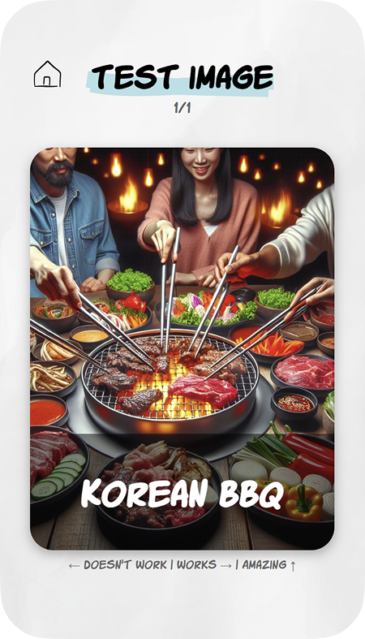
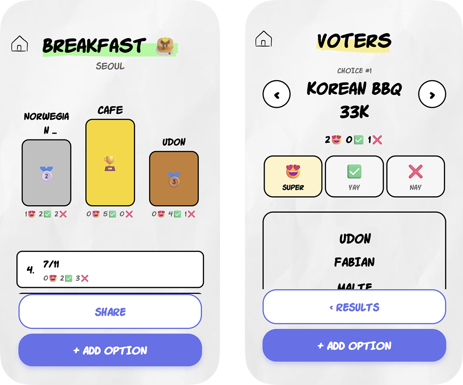
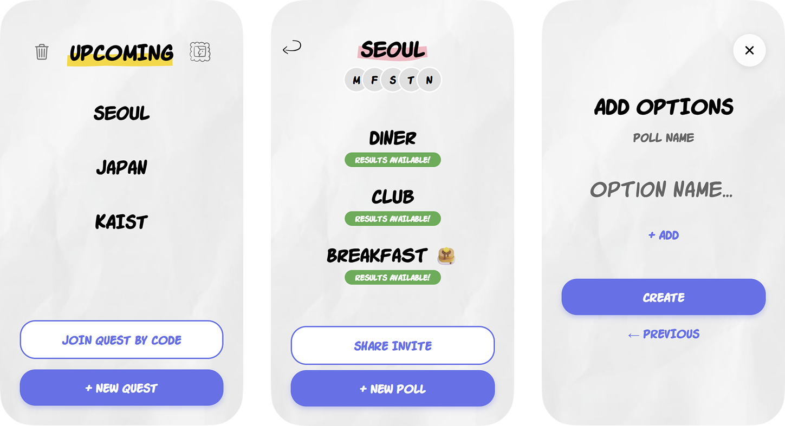

# DP#5 – Final Report

**Team:** Meet2Go

---

## 📋 TODO: Missing Items

### Representative Screenshots
- [x] Add callouts/annotations to screenshots --> added detailled captions instead

### Quality Arguments
- [ ] Add supporting user quotes/comments

### Deployment Summary
- [ ] Fill in Total Users count
- [ ] Fill in Total Quests Created count
- [ ] Fill in Total Votes Cast count
- [ ] Add visual aid (chart/graph showing engagement)
- [ ] Synthesize user feedback analysis
- [ ] Add more user feedback examples (ensure NO team-generated data)

### Individual Reflections
- [ ] Each member contributions

---

## Project Summary

**Problem:** Friend groups often fail to make collective decisions efficiently because group chat discussions are chaotic, fragmented, and fail to capture the nuance of individual preferences.

**Solution:** Meet2Go is a mobile-first decision-making app that transforms tedious planning into a fun, swipe-based game where users express preference strength on options to reach a fair consensus.

**Unique Approach:** Using a Tinder-style swipe interface to capture weighted preferences ("Doesn't Work", "Works", "Amazing"), making the process engaging while ensuring the final decision truly reflects the group's collective happiness.

## Representative Screenshots

*Figure 1: **The Swipe Voting Interface** — Users vote on options using intuitive gestures: swipe **left** for "Doesn't Work" (red), **right** for "Works" (green), or **up** for "Amazing!" (gold). Each card displays an AI-generated image and the option title. This Tinder-inspired UX makes voting feel like a game rather than a chore.*

*Figure 2: **The Consensus Results View** — After all members vote, the winning option is displayed with a recap of the weighted preferences. Users can see who voted and how, ensuring transparency. The algorithm on the backend removes social friction by letting the algorithm decide rather than individuals advocating for their preference.*

*Figure 3: **Quest Creation Flow** — Users create a "Quest" (decision) and add options. Each option automatically generates an AI image (using DALL-E) ensuring all suggestions have equal visual appeal regardless of text description quality or image choice. This levels the playing field and makes even simple text options feel engaging and "real."*

## Quality Arguments

*(Max. 300 words)*

Meet2Go delivers a "great" user interface by fundamentally redesigning the social chore of group coordination into a playful, engaging interaction.

**1. Transforming "Work" into "Play" (Incentives):**
Traditional scheduling tools feel administrative. Meet2Go’s swipe-based interactions (inspired by social apps) leverage familiar, low-friction gestures to lower the barrier to participation. The immediate visual feedback (card color changes) satisfy the user’s need for responsiveness, making the act of voting feel like a game rather than a survey.

**2. Capturing Nuance via Simple UI:**
A key quality of the interface is its ability to capture complex social data—preference intensity—without complex controls. The decision to use a 3-way swipe (Left/Right/Up) is a novel UI component that maps intuitively to human feelings ("Doesn't Work", "Works", "Amazing!"). This supports the expected social interaction by preventing the "lukewarm consensus" problem where groups settle for the option everyone "tolerates" but nobody "likes."

**3. Visual Polish and Responsiveness:**
The application uses React Native Reanimated to ensure smooth animations, which is critical for the tactile feel of the cards. The use of AI-generated images for every option ensures that even a text-based suggestion feels visual and engaging, enhancing the "window shopping" experience of picking a restaurant or activity.

## Deployment Summary

*(Max. 300 words)*

*How did your deployment go? Report the number of users, feedback from users, analysis, etc. Use visual aids.*

**Deployment Stats:**
*   **Total Users:** [Number]
*   **Total Quests Created:** [Number]
*   **Total Votes Cast:** [Number]

**User Feedback Analysis:**
(Summarize feedback here)

### A feedback
#### Process

1. Create an account
2. vote on the given poll
3. create 3 polls with multiple options
4. vote on the new poll
5. check results

#### Response

Background: 23 y.o. male, KAIST SoC & BTM co-major.

1. The initial voting page can be a bit unintuitive, with the fineprinted manual not very visible due to the finger position
2. Creating options for polls is broken on iPhone w/ iOS 26 [this was rememdied by providing an alternative phone]
3. The poll title is too small when creating options, which makes them unclear which poll I'm creating
4. The 'amazing' effect shown when voting amazing is not very visible (compared to works/doesn't work)

## Discussion

*(Max. 500 words)*

**Incentives for Participation:**
One of the core challenges in social computing is the "free rider" problem in collective action—everyone wants a plan, but nobody wants to plan it. Meet2Go addresses this by misaligning the cost of participation (low: just swipe) with the reward (high: a great group activity). By gamifying the input mechanism, we provide an intrinsic incentive to participate. The interface itself is the "sugar" that helps the "medicine" of decision-making go down.

**Supporting Social Interaction & Conflict Resolution:**
Social coordination is often hindered by the fear of social friction. In group chats, suggesting an idea can feel risky ("What if they hate it?"). Meet2Go decouples the suggestion from the judgment. Votes are aggregated, and while transparency is available, the primary view is the *consensus*, which shifts the focus from "User A vs. User B" to "Group vs. The Problem." This design supports pro-social interaction by bringing the group to a mathematical consensus that feels fair, rather than a political one dominated by the loudest voice.

**Quality Control & AI:**
We integrated generative AI to visually represent options. This acts as a quality control mechanism for the *content* of the poll. A bare text option "Pizza" is less engaging than "Pizza" with an image that smells melted cheese. This ensures that all options are presented on an equal visual footing, reducing bias based on how well a user described their suggestion.

**Privacy & Ethics:**
We considered the privacy implications of "preference intensity." While users can see who voted for what to ensure trust (transparency), we deliberately avoided negative reinforcement mechanics (e.g., "downvoting" a person's idea). The "Doesn't Work" swipe is framed as a logistical constraint rather than a personal rejection, protecting the social fabric of the group.

## Prototype & Repository

*   **Live Prototype:** https://meet2go.vercel.app/
*   **Repository:** https://github.com/alaaeddine-ahriz/meet2go

## Individual Reflections
